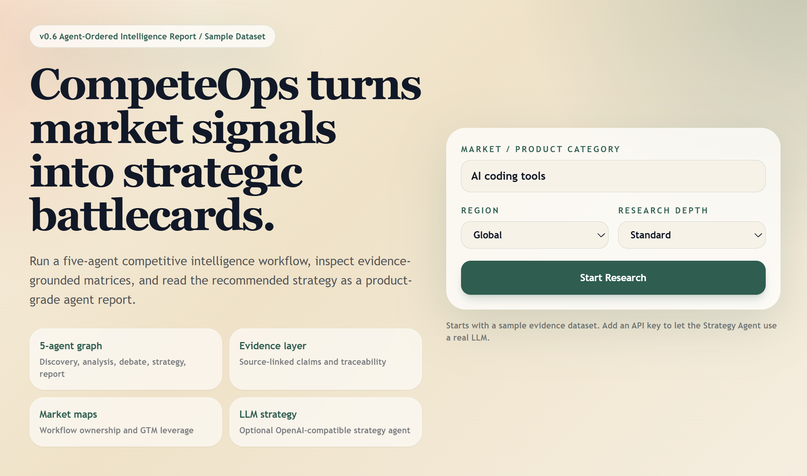
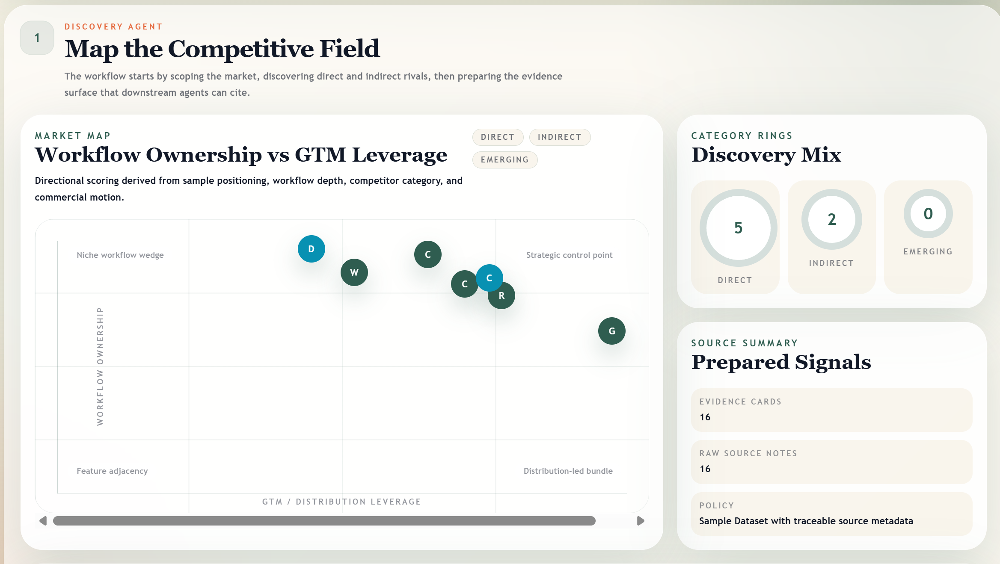
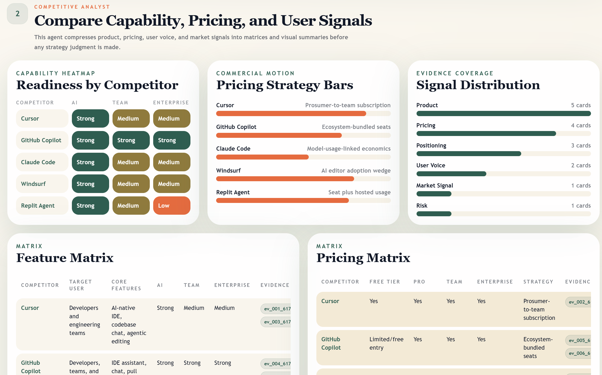
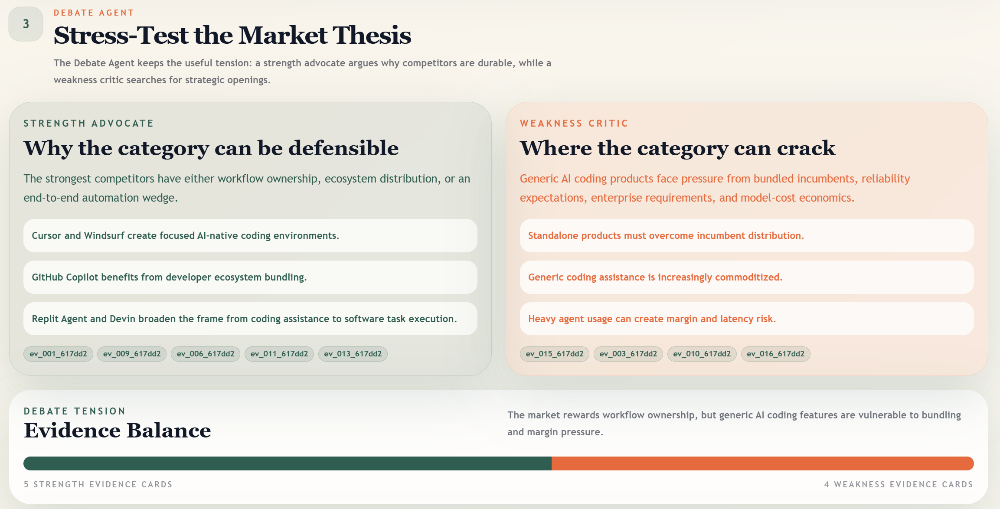
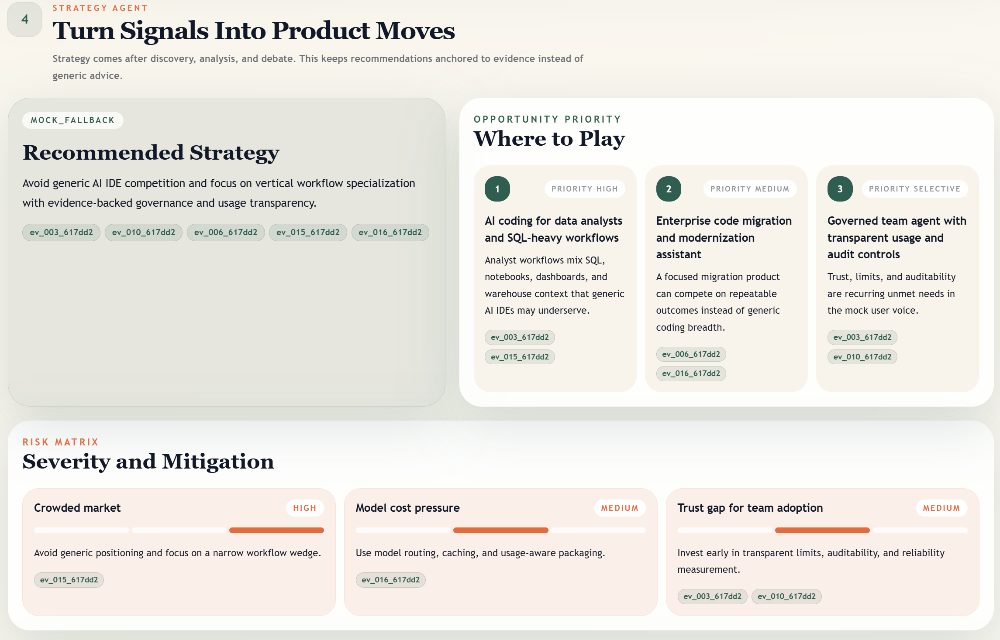
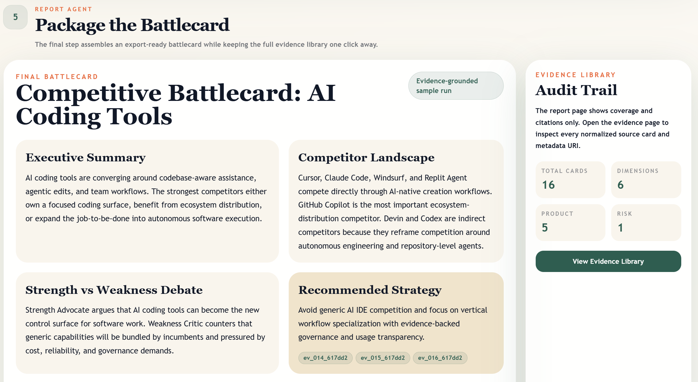
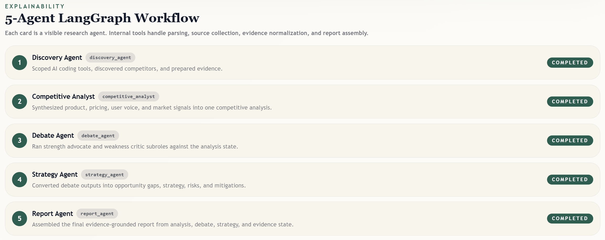

# CompeteOps

CompeteOps 是一个面向产品经理、创业团队和战略分析人员的多智能体竞品情报系统。

当前版本聚焦一个稳定、可演示、可扩展的 MVP：

```text
输入 AI coding tools
-> 创建 Research Run
-> 执行 5-Agent LangGraph workflow
-> 生成按 Agent 顺序组织的竞品情报报告
-> 输出 Battlecard、矩阵、图表、策略建议和可追溯证据库
```

## 项目定位

CompeteOps 不是普通 RAG 问答，也不是网页摘要工具。它的目标是把分散的市场、产品、价格、用户反馈和风险信号，组织成一套可追溯的竞品研究工作流，最终服务于产品策略判断。

一句话概括：

```text
CompeteOps turns market signals into evidence-grounded competitive battlecards.
```

当前 v0.6 的重点是：

- 用 5 个核心 Agent 表达真实研究流程。
- 用 evidence cards 保证每个结论可以追溯。
- 用图表和矩阵把报告产品化展示。
- 默认 demo 不依赖真实搜索、不需要 API key。
- 已开放 OpenAI-compatible LLM API 接口，可让 Strategy Agent 使用真实 LLM。

## 功能截图

### 首页



### Discovery Agent：竞品发现与市场地图



### Competitive Analyst：能力、价格和用户信号分析



### Debate Agent：正反方争论



### Strategy Agent：策略建议与风险矩阵



### Report Agent：最终 Battlecard



### Execution Details：5-Agent LangGraph 执行轨迹



## Multi-Agent 架构

当前 LangGraph workflow：

```text
discovery_agent
  -> competitive_analyst
  -> debate_agent
  -> strategy_agent
  -> report_agent
```

每个 Agent 都遵守统一 contract，并记录：

- agent name
- node name
- dependencies
- reads state
- writes state
- tools used
- subroles
- execution mode
- model name
- fallback reason
- evidence ids
- structured result

### 1. Discovery Agent

职责：

- 解析用户输入。
- 确定当前 mode 为 `competitive_analysis`。
- 发现竞品。
- 调用内部 source collector。
- 调用 evidence normalizer。
- 输出 competitors、evidence cards、evidence lookup。

当前 demo 生成竞品：

- Cursor
- GitHub Copilot
- Claude Code
- Windsurf
- Replit Agent
- Devin
- Codex

### 2. Competitive Analyst

职责：

- 汇总产品能力。
- 汇总价格策略。
- 汇总用户痛点。
- 汇总市场信号。
- 输出 feature matrix、pricing matrix、user pain points、market signals。

### 3. Debate Agent

职责：

- 内部运行 `strength_advocate`。
- 内部运行 `weakness_critic`。
- 形成 strength case、weakness case 和 debate synthesis。

这个节点保留了 TradingAgents-style 的“正反方辩论”思想，但对用户只展示为一个清晰的 Debate Agent。

### 4. Strategy Agent

职责：

- 根据 analysis、debate 和 evidence 生成机会点。
- 生成推荐策略。
- 生成风险和缓解措施。
- 在启用 API key 时，可以调用真实 LLM。
- 在 LLM 不可用时，自动 fallback 到 deterministic mock output。

### 5. Report Agent

职责：

- 汇总 final report。
- 生成 competitive battlecard。
- 保留证据引用。
- 输出最终报告页面使用的数据结构。

## 前端页面

当前有 3 个主要页面。

### 1. 首页

路径：

```text
/
```

功能：

- 输入 market / product category。
- 选择 region。
- 选择 research depth。
- 创建 research run。
- 默认输入是 `AI coding tools`。

### 2. Agent-Ordered Report 页面

路径：

```text
/runs/{runId}
```

内容按 Agent 顺序展示：

```text
Discovery
-> Competitive Analysis
-> Debate
-> Strategy
-> Report
-> Execution Details
```

主要图表：

- Workflow Ownership vs GTM Leverage market map。
- Category rings。
- Capability heatmap。
- Pricing strategy bars。
- Evidence distribution。
- Debate evidence balance。
- Opportunity priority grid。
- Risk severity matrix。
- Final Battlecard summary cards。

### 3. Evidence Library 页面

路径：

```text
/runs/{runId}/evidence
```

功能：

- 展示完整 evidence cards。
- 展示 evidence dimension distribution。
- 展示 source type grouping。
- 展示 competitor/source grouping。
- 报告页中的 citation badges 会跳转到这里对应的 evidence card。

## 后端 API

```text
POST /api/runs
GET /api/runs
GET /api/runs/{run_id}
GET /api/runs/{run_id}/competitors
GET /api/runs/{run_id}/evidence
GET /api/runs/{run_id}/agent-outputs
GET /api/runs/{run_id}/report
```

## 技术栈

Frontend:

- Next.js
- React
- TypeScript
- Tailwind CSS

Backend:

- FastAPI
- SQLite
- SQLAlchemy
- Pydantic

Workflow:

- LangGraph `StateGraph`
- 5-Agent shared-state workflow
- deterministic mock nodes
- optional LLM Strategy Agent

LLM:

- OpenAI-compatible chat completions interface
- 当前只接入 Strategy Agent
- 默认不开启

## 项目结构

```text
competeops/
  backend/
    app/
      main.py
      database.py
      models.py
      schemas.py
      routers/
      services/
        graph/
          contracts.py
          nodes.py
          state.py
          tools.py
          workflow_graph.py
        llm/
          openai_compatible.py
          schemas.py
          settings.py
          strategy.py
        mock_agents.py
        mock_sources.py
        workflow.py
    requirements.txt
  frontend/
    app/
      page.tsx
      runs/[runId]/page.tsx
      runs/[runId]/evidence/page.tsx
    components/
    lib/
    package.json
  docs/
    screenshots/
  README.md
```

## 本地运行

### 后端

PowerShell：

```powershell
cd D:\Desktop\competeops\backend
python -m venv .venv
.\.venv\Scripts\python.exe -m pip install -r requirements.txt
.\.venv\Scripts\python.exe -m uvicorn app.main:app --reload
```

如果 PowerShell 禁止执行 `activate.ps1`，不需要激活虚拟环境，直接使用：

```powershell
.\.venv\Scripts\python.exe -m uvicorn app.main:app --reload
```

后端地址：

```text
http://localhost:8000
```

API docs：

```text
http://localhost:8000/docs
```

### 前端

另开一个 PowerShell：

```powershell
cd D:\Desktop\competeops\frontend
npm install
npm run dev
```

前端地址：

```text
http://localhost:3000
```

如果后端不是 `http://localhost:8000`，可以设置：

```powershell
$env:NEXT_PUBLIC_API_BASE_URL="http://localhost:8000"
```

## LLM API 配置

默认情况下，不需要任何 API key，系统会完整运行 sample dataset demo。

如果希望 Strategy Agent 使用真实 LLM，在 `backend/.env` 中配置：

```text
ENABLE_LLM_STRATEGY=true
OPENAI_API_KEY=your_api_key_here
OPENAI_BASE_URL=https://api.openai.com/v1
OPENAI_MODEL=gpt-4o-mini
OPENAI_TIMEOUT_SECONDS=30
```

说明：

- `OPENAI_BASE_URL` 可选。
- 只要 provider 兼容 `/chat/completions` 格式，就可以接入。
- 如果 key 缺失、请求失败、响应不是合法 JSON、或输出没有合法 evidence ids，系统会自动 fallback。
- Agent Timeline 会显示 `execution_mode`，例如 `llm`、`mock`、`mock_fallback`。

## 验证命令

前端：

```powershell
cd D:\Desktop\competeops\frontend
npm.cmd run lint
npm.cmd run build
npm.cmd audit --audit-level=moderate
```

后端：

```powershell
cd D:\Desktop\competeops
python -m compileall backend\app
```

最近一次验证结果：

```text
npm lint: passed
npm build: passed
npm audit --audit-level=moderate: 0 vulnerabilities
python compileall: passed
FastAPI smoke test: passed
```

Smoke test 确认：

- competitors: 7
- evidence cards: 16
- visible agent outputs: 5
- report endpoint: 正常

